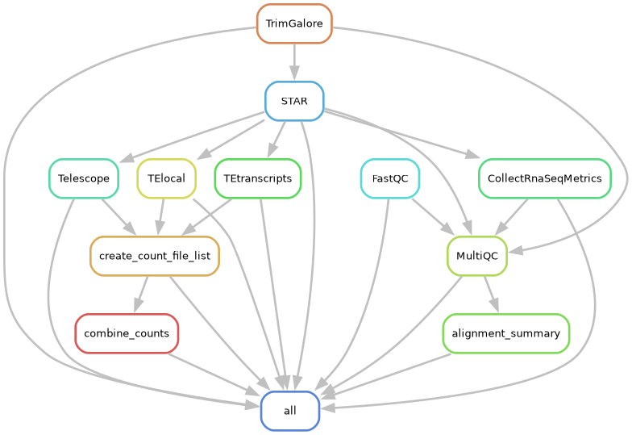

# RNA-seq snakemake pipeline - standard pipeline

## Snakemake Workflow DAG


This is a snakemake pipeline for RNA-seq analysis of repetitive element expression. This is a basic pipeline that process RNA-seq data according to our standard workflow and generates combined count tables containing raw counts from TEtranscripts, Telescope, and TElocal. TEtranscripts is a software that quantifies repetitive element expression at the subfamily level, while Telescope and TElocal quantify repetitive element expression at the locus-specific level. This pipeline generates four count tables, one for TEtranscripts, one for Telescope, and one for TElocal that contains gene + subfamily TE raw counts and gene + locus TE raw counts, respectively for all samples. The fourth count table that is generated contains the counts and RepeatMasker annotations/genomic coordinates for the repetitive elements identified in TElocal. This pipeline is designed to be run on a SLURM cluster.

The standard pipeline steps are as follows:

1. Initial QC - FastQC
2. Adapter/read trimming & 2nd pass QC - TrimGalore
3. Read alignment - STAR
4. QC report generation - MultiQC
5. Alignment QC - CollectRnaSeqMetrics from Picard
6. Gene and TE subfamily read calling - TEtranscripts
7. Locus-specific read calling - Telescope
8. Locus-specific read calling - TElocal
9. Combine count files from TEtranscripts and Telescope - combine_counts

This pipeline assumes paired end data!

This pipeline is designed to be run on a SLURM cluster. The cluster configuration file is `RNAseq.standard.Snakemake.cluster.config.yaml`. The pipeline configuration file is `RNAseq.standard.Snakemake.config.yaml`.

## Setup:

### Create a snakemake environment

#### 1. Download or copy the snakemake.yaml file (located in the envs folder)

#### 2. Load miniconda

`ml miniconda3`

#### 3. Create the snakemake environment

`conda env create -n snakemake -f snakemake.yaml`

#### 4. Create a folder to store conda environments

#### This pipeline will automatically generate conda environments required for some rules. To avoid repetitive installations when running the pipeline in the future, create a folder to store the environments. This can be in your home directory. Below is an example:

`mkdir ~/snakemake_environments`

### Raw data requirements:

- Raw files must be in the format: `<sample name>_<read>.<fastq file extension>`
  - `<sample name>` Can be anything you want, but do not have any hyphens in the name! Underscores or dots are fine.
  - `<read>` R1 for read 1 and R2 for read 2.
  - `<fastq file extension>` This is set in the config file. Must be gzipped fastq files (e.g., fastq.gz, fq.gz).

### Folder structure:

- Raw data should be located in folder called `raw_files`.
- `RNAseq.standard.Snakefile`, `RNAseq.standard.Snakemake.cluster.config.yaml`, and `RNAseq.standard.Snakemake.config.yaml` must be in the working directory.
- All environment yaml files should be located in a folder called `envs` in the working directory. The environment yaml files are:
  - fastqc.yaml
  - trimgalore.yaml
  - picard.yaml
  - tetranscripts.yaml
  - telescope.yaml
  - telocal.yaml
  - combine_counts.yaml
- The `scripts` folder should be in the working directory. This folder contains the `combine_counts.py` script to combine the count files from TEtranscripts, Telescope, and TElocal, respectively.
- All other subfolders will be created automatically.

## To run the pipeline:

1. Start a new tmux session with the command `tmux new-session -s <session name>`
2. Activate the snakemake environment with the command `conda activate snakemake`
3. Navigate to the working directory where the Snakefile, cluster config, and config files are located as well as the raw data and envs and scripts subfolders.
4. Run the snakemake command:

```bash
snakemake -s RNAseq.standard.Snakefile -j 100 --use-conda --conda-prefix ~/snakemake_environments --configfile RNAseq.standard.Snakemake.config.yaml --cluster-config RNAseq.standard.Snakemake.cluster.config.yaml --cluster "sbatch -o {cluster.output} -e {cluster.err} -p {cluster.p} -N {cluster.N} -J {cluster.jobName} -t {cluster.time} --mail-user={cluster.mail-user} --mail-type={cluster.mail-type}"
```

Snakemake will create four tsv files located in `results/` containing the raw counts from TEtranscripts, Telescope, and TElocal. See below for the outputs corresponding to each software. A csv file containing the alignment metrics from Picard's CollectRnaSeqMetrics and STAR will also be generated in the `results/` folder. Below is a description of each output files:

1. `tetranscripts_counts.tsv` - Contains the raw counts from TEtranscripts for all samples.
2. `telescope_counts.tsv` - Contains the raw counts from Telescope for all samples.
3. `telocal_counts.tsv` - Contains the raw counts from TElocal for all samples.
4. `telocal_counts_annotated.tsv` - Contains the raw counts from TElocal for all samples with the RepeatMasker annotations and genomic coordinates for each repetitive element.
5. `alignment_summary.csv` - Contains a selection of alignment metrics from Picard's CollectRnaSeqMetrics and STAR for all samples.

The `tetranscripts_counts.tsv`, `telescope_counts.tsv`, and `telocal_counts.tsv` count tables are ready for downstream analysis. For example, these count tables can be used as input for DESeq2 to identify differentially expressed repetitive elements.

**Note**: the first time running this pipeline will take awhile as all of the conda environments in the `envs/` folder will be installed. However, with the `--conda-prefix` option specified, Snakemake will store and reuse these conda environments for future runs.
